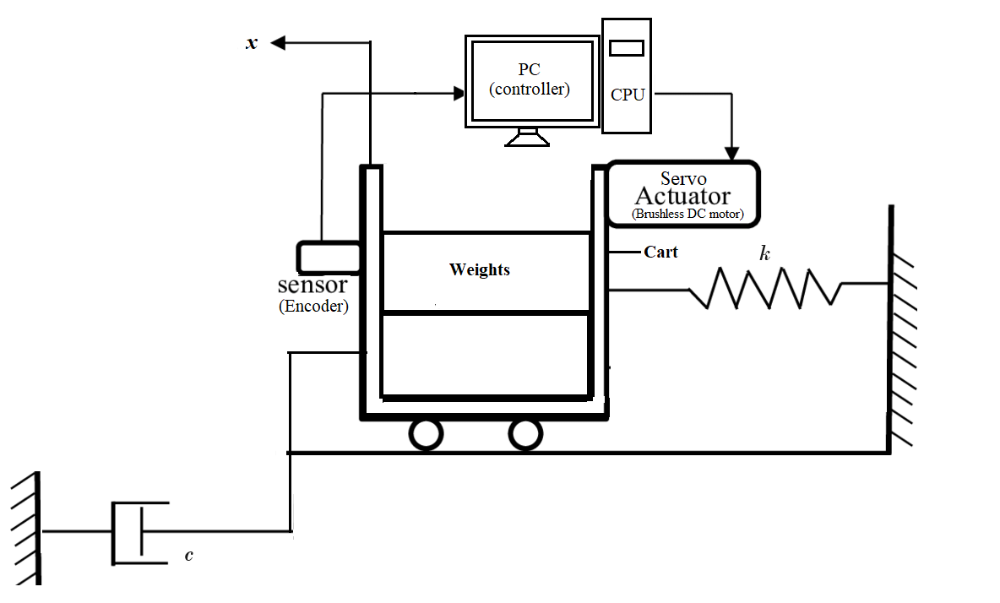

### Procedure
								

<b>Fig 1: Schematic diagram of rectilinear motion control plant</b>

**Steps to perform the simulation**

1. At first drag weights and drop them in the mass carriage system. Each of the weights are of 500g. First drag all the weights (i.e. 2 kg mass).

2. Under 'Controls' section click on 'Trajectory' under command tab, then click on 'Step'. After that click on 'Setup', put step size to zero, set dwell time to 3000 ms and 2 repetition . Select 'Open loop step' and 'Ok'.

3. Click on "Setup Data Acquisition" under 'Data' tab, put 2 as the value of servo cycles and select 'Encoder Position'.

4. Drag the mass carriage system through the slider up to -2.5 cm.

5. Click on 'Execute' under 'command', then click on 'RUN' button. The system starts to oscillate.

6. After the carriage stops oscillating, an alert massage will be shown. Click on 'Ok'.

7. Click on 'Set up Plot' under 'Plotting'. Select 'Encoder Position' and click 'Ok'.

8. Click on 'Plot data' under 'Plotting' ,the 'Open loop step' response for the particular mass chosen, will be shown.

9. Click on 'Reset Controller' under 'Utility' tab to observe the response for unloaded mass by choosing no weights and following the steps 2 - 8.

10. Under 'Calculation' tab select 'Without Damper', enter both the mass values chosen ( for ex. here the first mass was 2 kg and second one is 0 kg ) and click on 'Simulate' to have the values of Mc (mass of the carriage) and K (spring constant).

11. Now click on 'Connect Dashpot' button to connect the dashpot to the mass carriage system.

12. Similarly drag 2 kg weight again and follow the above steps( 2 - 8 ) to observe open loop step response of the mass carriage system with connected dashpot.

13. Under 'Calculation' tab select 'With Damper', enter the mass value chosen ( for ex. here the mass was 2 kg ) and click on 'Simulate' to have the value of C ( dashpot damping coefficient ).

14. To observe system velocity first remove dashpot from the mass carriage system by clicking on 'Remove Dashpot' button. Now secure 2 kg mass in the carriage.

15. Steps will be same as in steps ( 2 - 8 ) with some following edits.

i) In step 2 set dwell Time to 75 ms and repetition 3.

ii) In step 3 select 'Encoder Velocity'.

iii) In step 7 Select 'Encoder Velocity' and click 'Ok'.

16. Calculate acceleration (for both positive & negative slope) using formula (velocity difference/ time difference) from the velocity vs. time plot.

17. Under 'Calculation' tab select 'Gain Calculation'. Enter the acceleration values from positive slope and negative slope of velocity vs. time plot. Click on 'Simulate'.
 					
  