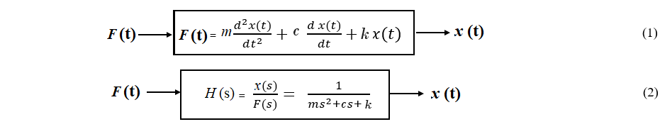
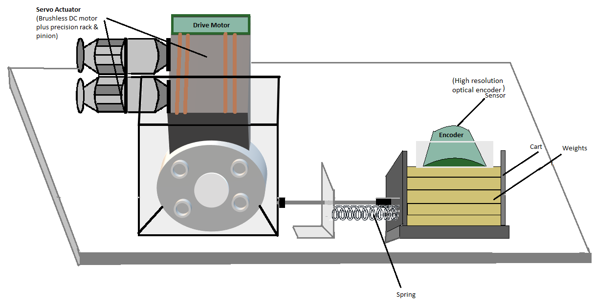

# Theory

**Rectilinear Motion:**

Rectilinear motion is another name of straight-line motion. This type of motion describes the movement of a particle or a body. A body is said to experience rectilinear motion if any two particles of the body travel the same distance along two parallel straight lines. The figure below illustrates rectilinear motion for a body.

<b>Fig 1: Rectilinear Motion</b>

The experimental control system in practical laboratory is comprised of the electromechanical plant which consists of the spring-mass mechanism, its actuator and sensors and a subsystem 
i.e. an operating program or software which runs on a PC .

**Encoder:**

An encoder is a sensor that converts a positional output into an electronic signal. In this experiment, encoder counts are used as the system units of position, where the counts correspond to the encoder pulses and controller-internal register values. Here, 1 encoder revolution is equivalent to 16,000 encoder counts, which corresponds to 7.06 cm.

**Rectilinear Motion setup in Control Systems:**

<b>Fig 2: Rectilinear Motion setup without dashpot connected</b>

<b>Fig 3: Rectilinear Motion setup with dashpot connected</b>

Re arranging the equation (2) and comparing the denominator terms with the characteristics equation of a
second order control system we get,

$$s^2 + 2 \zeta \omega_n s + \omega_n^2 = s^2 + \frac{c}{m}s + \frac{k}{m}$$

$$\omega_n^{2} = \frac{k}{m}$$

$$\zeta (damping \ ratio) = \frac{c}{2 \sqrt{k m}}$$

$$\omega_d = \omega_n \sqrt{(1 - \zeta^{2})}$$

Where,

<i style ="font-family:'Times New Roman'"><b>m</b></i> = Total mass ( mass of the cart + weights )

<!--Mc = Mass of the cart -->
<i style ="font-family:'Times New Roman'"><b>k</b></i> = Spring constant

<i style ="font-family:'Times New Roman'"><b>c</b></i> = Damping coefficient

<i style ="font-family:'Times New Roman'"><b>F (t)</b></i> = Applied force

<i style ="font-family:'Times New Roman'"><b>x(t)</b></i> = Time varying position of the cart

<i style ="font-family:'Times New Roman'"><b>&omega;n</b></i> = Natural frequency of oscillations

<i style ="font-family:'Times New Roman'"><b>&omega;d</b></i> = Damped natural frequency of oscillations

<b>Fig 4: Open loop step plot for 1 kg mass on Mass Spring Damper system without connecting the dashpot</b>

 

<b>Fig 5: Rectilinear Plant</b>

The hardware gain, khw,  of the system is comprised of the product: 

khw = kc ka kt kmp ke kep <!--ks--> 

where the theoretical values are:

kc, the DAC gain, = 10V / 32,768 DAC counts

ka, the Servo Amp gain, = approx 2 ( amp/V )

kt, the Servo Motor Torque constant =  approx 0.1 ( N-m/amp )

kmp, the Motor Pinion pitch radius inverse = 26.25 m-1

ke, the Encoder gain, = 16,000 pulses / 2&#960; radians

kep, the Encoder Pinion pitch radius inverse = 89 m-1

<!--ks, the Controller Software gain, = 32-->                          
						
								